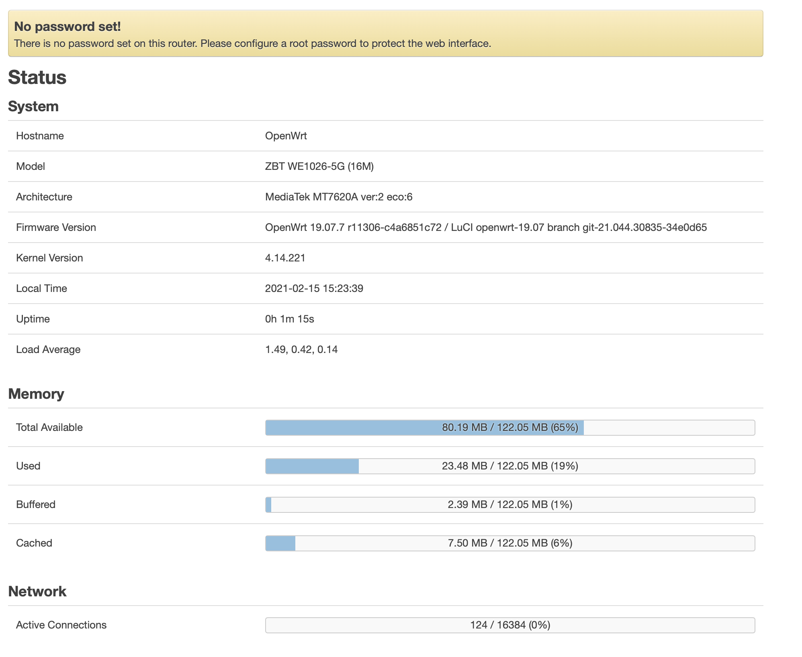

# How to flash to openwrt

TL;DR; Status: OpenWRT boots nice , but reboots every 2 minutes 

## Images URL

1. https://openwrt.org/toh/hwdata/zbt/zbt_we1026-5g - old, reboots
2. https://downloads.openwrt.org/releases/19.07.7/targets/ramips/mt7620/ - looks like really latest, but reboots
3. https://drive.google.com/drive/folders/1few_ljURycBckp9P4uo09TbD7Y2WNETn - reboots
4. https://www.ofmodemsandmen.com/firmware16.html - reboots

## Images status

1. gargoyle_1.11.0-ramips-mt7620-we1026-5g-16m-squashfs-sysupgrade.bin - reboots
2. openwrt-we1026-5G-GO2020-03-01-upgrade.bin - reboots
3. openwrt-WiFiX-WE1026-5G-GO2020-05-16-upgrade.bin - reboots
4. openwrt-19.07.7-ramips-mt7620-we1026-5g-16m-initramfs-kernel.bin - reboots
5. openwrt-19.07.7-ramips-mt7620-we1026-5g-16m-squashfs-sysupgrade.bin - reboots
6. mt7620-WE1026-5G-20191101_233435.bin - original firmware, no reboots, but routing problem so no work
7. openwrt-18.06.9-ramips-mt7620-we1026-5g-16m-squashfs-sysupgrade.bin - reboots

## Possible fix 

1. for gargoyle - https://www.gargoyle-router.com/phpbb/viewtopic.php?t=10920 - log, ask `logread` and (poss) remove `/usr/data/bwmon` and `/usr/data/quotas`

none. no any errors in logs ;(

## If header checksum error -> header resign

Actually this not need. 

1. Grab image
2. Open image in hex editor
3. Change name of image to "MQWRT:MTK:WE1026-5G:0" at 0x20
4. Get off image header
```
dd if=image of=header bs=1 count=64
```
5. Claer CRC in image header. Set 4 bytes from 0x4 till 0x8 to 0
6. Calculate CRC
```
crc32 header
```
7. Put those bytes from 0x4 to image


## Console

```
$ ssh root@192.168.1.1
The authenticity of host '192.168.1.1 (192.168.1.1)' can't be established.
RSA key fingerprint is SHA256:K9EQaYpSCIFlExejr9o3lDGyFtgVtaLLxe1JYzWKD00.
This key is not known by any other names
Are you sure you want to continue connecting (yes/no/[fingerprint])? yes
Warning: Permanently added '192.168.1.1' (RSA) to the list of known hosts.


BusyBox v1.30.1 () built-in shell (ash)

  _______                     ________        __
 |       |.-----.-----.-----.|  |  |  |.----.|  |_
 |   -   ||  _  |  -__|     ||  |  |  ||   _||   _|
 |_______||   __|_____|__|__||________||__|  |____|
          |__| W I R E L E S S   F R E E D O M
 -----------------------------------------------------
 OpenWrt 19.07.7, r11306-c4a6851c72
 -----------------------------------------------------
=== WARNING! =====================================
There is no root password defined on this device!
Use the "passwd" command to set up a new password
in order to prevent unauthorized SSH logins.
--------------------------------------------------
```

## Web UI

Between reboots I able log to web UI

