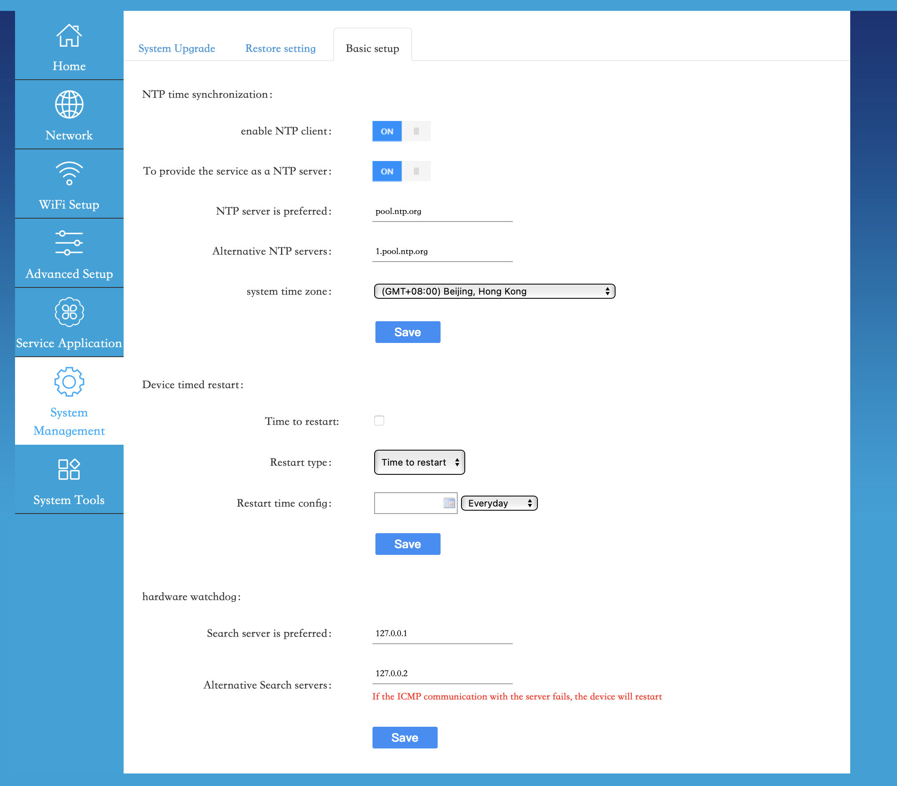

# Pain with stock firmware

## reboos every 90 seconds

Its stupids "web site access watchdog". If no pings from 8.8.8.8, it simple reboot router. But in real life booting, dialing up to cellular provider, etc is a little longer (smile). So you never see something works

How to fix: come to System Management - Basic setup, scroll down, and put 127.0.0.1 and 127.0.0.2 as shown below, then hit save
 
